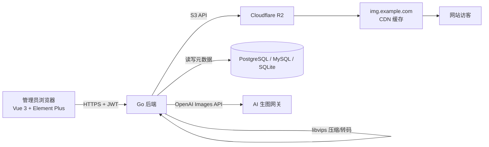
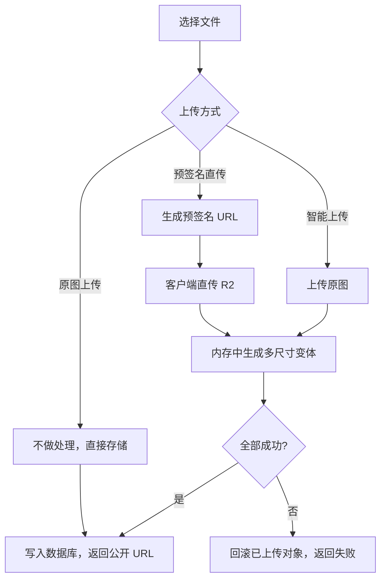
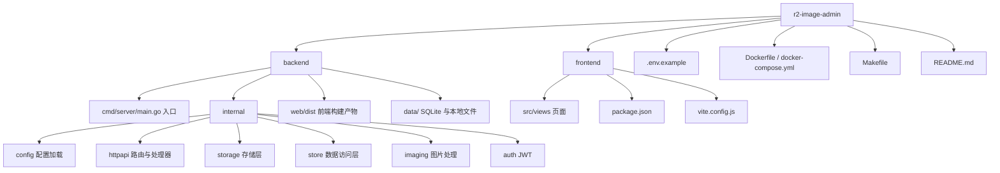

# R2 图床管理后台

一个自托管的图片资源管理后台，前端使用 Vue 3 + Element Plus，后端是 Go HTTP 服务。上传图片后自动生成多尺寸、多格式变体，支持图库浏览、搜索、替换、删除，并可选本地文件系统或 Cloudflare R2 作为存储。

当前还集成了基于 OpenAI Images API 的 AI 生图工作站：在设置页配置接口地址与 API Key 后，可直接生成图片，再放弃或一键上传到图片管理。

当前版本：`v2.0.0`。发布记录见 [CHANGELOG.md](CHANGELOG.md)。

## v2.0.0 发布重点

- 前端统一切换为 Vue 3 + Element Plus 后台 UI，覆盖登录、仪表盘、图片管理、AI 生图、设置与 R2 指南。
- 设置保存后支持自动重启，配置写入后新进程会自动接管服务端口。
- 仪表盘增加服务器资源占用、运行时长、Go 运行时、磁盘与存储统计，数据更适合日常巡检。
- Cloudflare R2 接入指南独立成鉴权页面，并从存储配置弹窗跳转查看。
- 按等保二级应用层要求补强登录限流、JWT 校验、安全响应头、上传校验、CORS 白名单和审计日志。

## 页面路由

| 路径 | 页面 | 说明 |
| --- | --- | --- |
| `/login` | 登录 | 默认账号 `admin`，默认密码 `admin123` |
| `/` | 仪表盘 | 图片统计、分类分布、服务器资源占用 |
| `/gallery` | 图片管理 | 缩略图网格、搜索、分类、上传、详情、替换、删除 |
| `/ai` | AI 生图工作站 | 提示词生成图片，可放弃或直接上传使用 |
| `/settings` | 系统设置 | 各功能卡片弹窗配置，保存后自动重启生效 |
| `/r2-guide` | R2 接入指南 | 仅登录管理员可查看的 Cloudflare R2 图文配置说明 |

> 当前本地实例运行在 `http://localhost:8081`，登录 `admin / admin123`。

## 核心功能

- JWT 登录鉴权，固定签名算法、签发方与受众校验；会话最长 24 小时
- 智能上传：生成 `IMG_SIZES` 尺寸 + 原尺寸 `IMG_FORMATS` 变体，可保留原图
- 原图上传：不做处理，适合 PNG 直传与 AI 生成图；仍会校验为受支持的位图图片
- 图库管理：缩略图网格、搜索、分类筛选、分页、复制链接/Markdown/srcset、替换、删除
- 仪表盘：图片总数、存储占用、分类分布、内存、磁盘、运行时长、Go 版本、Goroutine、GC 次数等资源数据
- 设置页：存储、图片处理、上传限制、AI 生图、安全等模块分别弹窗配置；AI 生图支持「同步上游模型」后下拉选择
- 保存后自动重启：设置项写入 `.env` 后，新进程自动拉起并接管端口
- AI 生图：后端代理 OpenAI Images API，密钥仅保存在服务端 `.env`，前端只显示是否已配置
- 安全控制：同源默认、CORS 精确白名单、登录失败限流、请求/上传大小限制、SVG 拦截、安全响应头与审计日志
- 安全审计：记录登录成功/失败/拦截及所有受保护写操作，默认留存 180 天
- 预签名直传 API：可直传 R2（需在 R2 桶配置 CORS）
- 上传自动写入 `Content-Type` 与 `Cache-Control`

## 技术栈

| 层 | 技术 |
| --- | --- |
| 前端 | Vue 3 + Element Plus + Vue Router + Vite + Axios |
| 后端 | Go（net/http + chi 路由） |
| 图片处理 | libvips（项目强制依赖，`make setup` / `make install-vips` 会自动安装） |
| 存储 | 本地文件系统 / Cloudflare R2（S3 API） |
| 数据库 | SQLite / PostgreSQL / MySQL（GORM） |
| 鉴权 | JWT + bcrypt |

## 架构



## 上传流程



## 目录结构



## 快速开始

### 本地开发（无需云账号）

```bash
# 1. 首次下载项目后执行初始化：自动安装 libvips、前端依赖，并创建数据目录
make setup

# 2. 后端（SQLite + 本地磁盘存储，自动带 libvips）
make dev-api
# 默认监听 :8080

# 3. 前端（另开终端，http://localhost:5173，已代理 /api 与 /files 到 8080）
make dev-web
```

> 如果不想用 Makefile，也可以直接执行 `./scripts/install-libvips.sh` 安装 libvips，然后运行 `cd backend && CGO_ENABLED=1 go run -tags=vips ./cmd/server`。

### 构建前端后由 Go 统一托管（更像生产）

```bash
make build
# 构建产物默认在 backend/bin/r2-image-admin；如需直接跑：
# ADDR=:8080 backend/bin/r2-image-admin
```

### Docker（推荐生产方式）

```bash
cp .env.example .env
# 编辑 .env，至少填写 R2_*、PUBLIC_BASE_URL、ADMIN_PASSWORD、JWT_SECRET、POSTGRES_PASSWORD、DB_DSN
docker compose --env-file .env up --build -d
```

Compose 默认只绑定 `127.0.0.1:8080`；请使用 Nginx、Caddy 或负载均衡器在前方终止 HTTPS，再由本机反向代理访问服务。生产环境不应直接暴露 HTTP 端口。

## 环境变量

| 变量 | 说明 | 默认 |
| --- | --- | --- |
| `ADDR` | 监听地址 | `:8080` |
| `APP_ENV` | `development` / `production`；生产会拒绝弱口令、本地存储与非 HTTPS 公开域名 | `development` |
| `AUTO_RESTART` | 保存设置后是否自动重启 | `true` |
| `CORS_ALLOWED_ORIGINS` | 允许跨域的精确来源，英文逗号分隔；留空仅同源 | — |
| `AUDIT_RETENTION_DAYS` | 审计日志留存天数，范围 30-3650 | `180` |
| `DB_DRIVER` | `postgres` / `mysql` / `sqlite` | `sqlite` |
| `DB_DSN` | 数据库连接串 | `data/r2admin.db` |
| `STORAGE_DRIVER` | `r2` / `local` | `local` |
| `LOCAL_DATA_DIR` | 本地存储目录 | `data/files` |
| `R2_ACCOUNT_ID` | Cloudflare Account ID | — |
| `R2_ACCESS_KEY_ID` / `R2_SECRET_ACCESS_KEY` | R2 API Token | — |
| `R2_BUCKET` | Bucket 名称 | `site-images` |
| `PUBLIC_BASE_URL` | 图片公开域名 | — |
| `ADMIN_USERNAME` / `ADMIN_PASSWORD` | 管理员账号（首次启动创建） | `admin` / `admin123` |
| `JWT_SECRET` | 签名密钥，生产必须改 | 开发默认值 |
| `JWT_TTL_HOURS` | JWT 有效期（小时），范围 1-24 | `12` |
| `IMG_SIZES` | 生成尺寸（px） | `400,800,1200,1600` |
| `IMG_FORMATS` | 输出格式 | `webp`（可加 `avif`） |
| `IMG_QUALITY` | 压缩质量 1-100 | `82` |
| `IMG_KEEP_ORIGINAL` | 是否保留原图 | `true` |
| `UPLOAD_MAX_MB` | 单文件上限 | `20` |
| `AI_IMAGE_API_URL` | AI 生图接口地址 | `https://api.openai.com/v1/images/generations` |
| `AI_IMAGE_API_KEY` | AI 生图 API Key | — |
| `AI_IMAGE_MODEL` | AI 生图模型 | `gpt-image-1` |
| `AI_IMAGE_ALLOWED_HOSTS` | AI 网关主机白名单，英文逗号分隔；为空时拒绝本机/私网 IP | — |

## API 一览

| 方法 | 路径 | 说明 |
| --- | --- | --- |
| POST | `/api/auth/login` | 登录，返回 JWT |
| GET | `/api/auth/me` | 当前登录用户 |
| POST | `/api/images` | 智能上传（multipart：`file` + 可选 `category`） |
| POST | `/api/images/direct` | 原图上传（不做处理） |
| GET | `/api/images` | 列表（`q`/`category`/`page`/`pageSize`） |
| GET | `/api/images/categories` | 分类统计 |
| GET | `/api/images/{id}` | 详情 |
| PUT | `/api/images/{id}` | 替换图片，URL 不变 |
| DELETE | `/api/images/{id}` | 删除记录及存储对象 |
| POST | `/api/presign` | 生成 R2 预签名直传链接 |
| POST | `/api/presign/confirm` | 直传完成后登记记录 |
| POST | `/api/ai/generate` | AI 生图（body：`prompt` + 可选 `size`） |
| POST | `/api/ai/models/sync` | 同步上游可用模型列表（body 可选 `api_url` / `api_key`） |
| GET | `/api/stats` | 图片统计 |
| GET | `/api/resources` | 服务器资源与磁盘占用 |
| GET | `/api/audit-logs` | 安全审计日志（分页） |
| GET | `/api/guides/r2` | R2 接入指南内容（需鉴权） |
| GET | `/api/config` | 当前配置（密钥不返回明文） |
| PUT | `/api/config` | 保存配置，`auto_restart=true` 时自动重启 |
| GET | `/api/health` | 健康检查（无需鉴权） |

除 `login` 和 `health` 外均需 `Authorization: Bearer <token>`。

## 存储目录规则

```text
<分类>/<8位随机ID>/main.webp        主图（原尺寸）
<分类>/<8位随机ID>/400.webp         400px
<分类>/<8位随机ID>/800.webp         800px
<分类>/<8位随机ID>/1200.webp        1200px
<分类>/<8位随机ID>/1600.webp        1600px
<分类>/<8位随机ID>/original.jpg     原图（可配置关闭）
```

文件名带唯一 ID，缓存友好；「替换图片」覆盖同路径文件，保证 URL 不变。

## 服务器部署

1. 准备 `.env`（参考 `.env.example`），生产模式设置 `APP_ENV=production`，并配置数据库、R2、强管理员口令（至少 12 位）和至少 32 位的 JWT 密钥。
2. 执行 `make install-vips` 安装 libvips。
3. 执行 `make build-web` 构建前端。
4. 执行 `make build` 编译带 libvips 的后端二进制。
5. 运行：`ADDR=127.0.0.1:8080 backend/bin/r2-image-admin`，由 HTTPS 反向代理对外暴露。
6. 或用 Docker Compose 一键部署；Docker 镜像以非 root 用户运行，移除 Linux capabilities，并在构建阶段自动安装 libvips。

## 安全与等保二级落地

代码已覆盖等保二级应用层的身份鉴别、访问控制、输入校验、安全审计与漏洞修复基础项。生产启动会拒绝弱口令、弱 JWT 密钥、本地文件存储和非 HTTPS 图片域名。管理员在设置页修改密码时，系统会同时轮换 JWT 密钥并使所有会话失效。

仍需由部署环境落实以下测评证据：HTTPS 证书与反向代理配置、主机基线/补丁、数据库 TLS 与备份恢复演练、R2 桶最小权限和 CORS、日志集中留存不少于制度要求、账号审批/权限复核/应急预案等。它们不属于应用代码可单独完成或替代的测评项。

## 已知问题

以下问题已识别但尚未修复，仅作记录：

1. **相册搜索防抖存在竞态**：快速输入时旧请求可能覆盖新结果。
2. **主图格式失败无降级**：`IMG_FORMATS` 首位格式（如 avif）生成失败会直接 500。
3. **AI 网关域名解析仍依赖部署侧 DNS 安全**：应用会拒绝显式本机/私网 IP，生产建议始终配置 `AI_IMAGE_ALLOWED_HOSTS`，并由出口网络限制外连目标。
4. **等保测评环境项不能由代码替代**：TLS、主机防护、备份、集中日志、制度和人员管理需在部署与运维侧提供证据。

## 常见问题

- **页面里看不到图 / 变成下载**：确认上传时写入了 `Content-Type`（后台已自动处理），且浏览器访问的是 `PUBLIC_BASE_URL` 域名。
- **提示 501 图片处理未启用**：通常是当前二进制未带 libvips；执行 `make install-vips && make build` 后重启服务即可。
- **AVIF 没生成**：说明所用 libvips 未编译 heif/avif 支持，属于正常降级。
- **AI 生图提示未配置**：到「系统设置 → AI 生图 → 配置」填写接口地址与 API Key；填写后可点「同步上游模型」选择模型。
- **AI 生成成功但上传失败**：当前未启用 libvips 时，工作站会使用「原图上传」写入图片管理，若提示失败请检查存储是否可写；仅接受位图格式。
- **直传（预签名）跨域失败**：需在 R2 桶配置 CORS，允许后台域名使用 `PUT` 方法。
- **默认密码**：开发模式未设置 `ADMIN_PASSWORD` 时会使用 `admin123`，仅用于本机试跑；生产模式会拒绝启动。请立即在“系统设置 → 安全”设置至少 12 位强密码。
